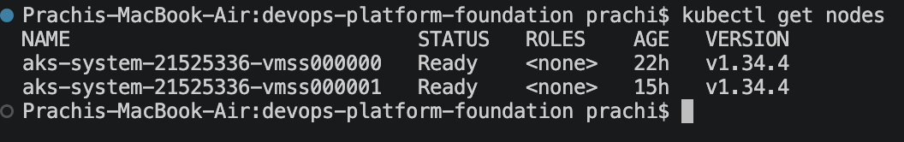
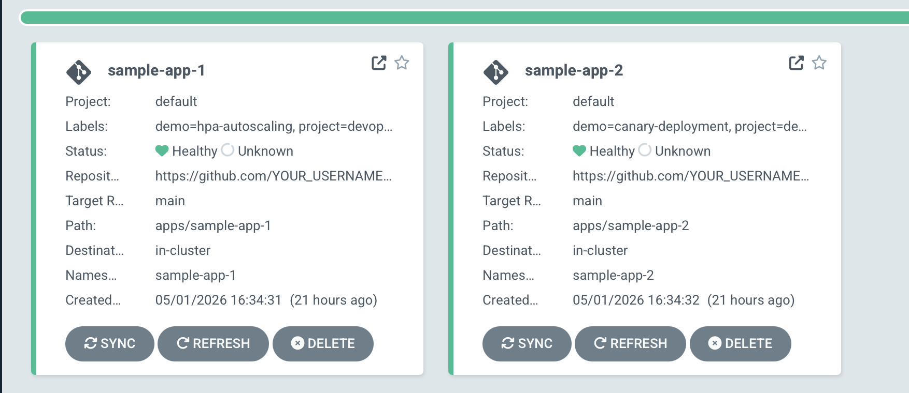
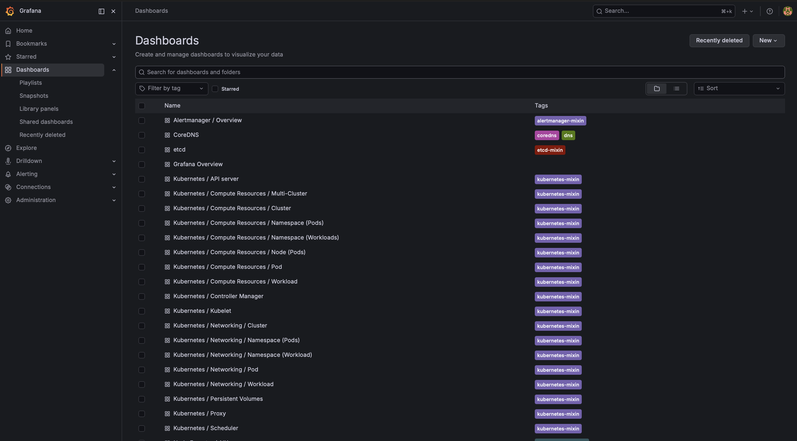
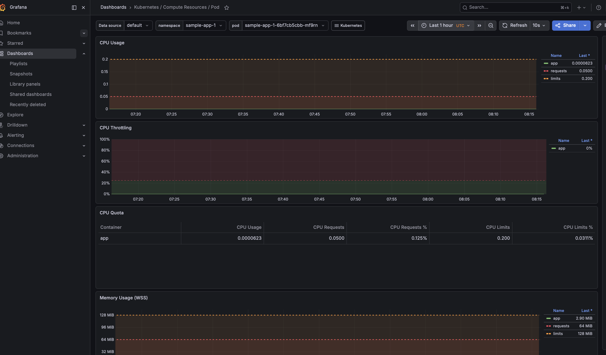
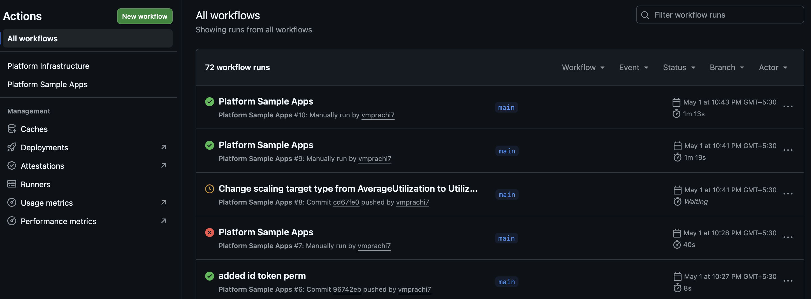
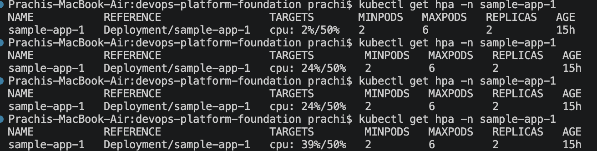
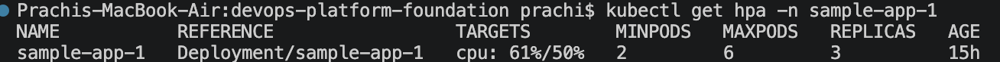
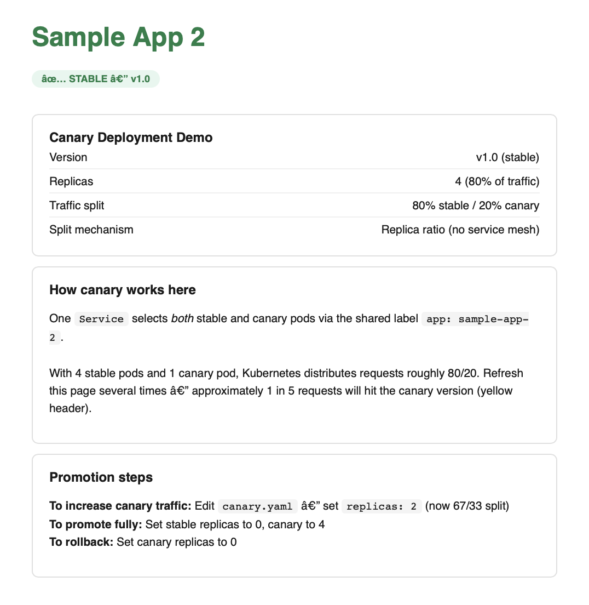
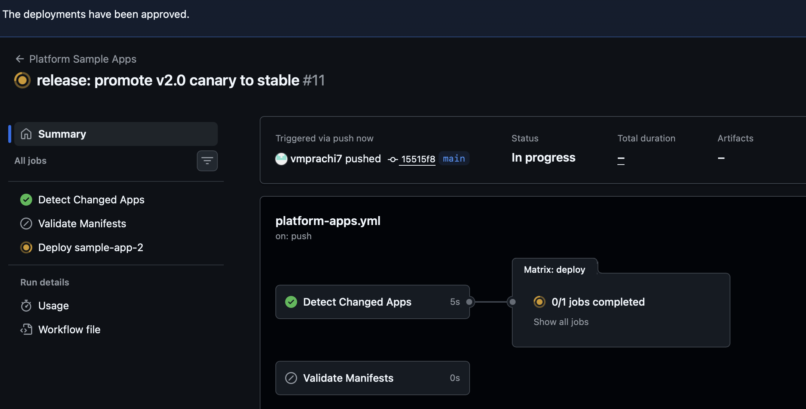

# devops-platform-foundation

> Production-grade Kubernetes platform on Azure — provisioned with Terraform,
> delivered via ArgoCD GitOps, observed through Prometheus + Grafana + Loki.
> Two sample apps demonstrate HPA autoscaling and canary deployments.
> Uses Workload Identity Federation — no long-lived credentials in pipelines.


---

## What this repo is

This is the **platform layer** — it owns infrastructure, GitOps configuration,
observability, and two sample apps that demonstrate platform capabilities.

Application repos (finops-engine, agentic-aiops) are independent.
ArgoCD watches each app repo directly — this repo only registers them as a
one-time pointer.

```
devops-platform-foundation/          finops-intelligence-engine/
├── Terraform → AKS + ACR           ├── Python app code
├── ArgoCD → installed + configured  ├── Dockerfile
├── Observability → Prom+Graf+Loki   ├── k8s/ ← ArgoCD watches this
├── apps/                            └── CI/CD ← fully autonomous
│   ├── sample-app-1/ (HPA demo)
│   └── sample-app-2/ (canary demo)
└── gitops/argocd-apps/
    ├── sample-app-1.yaml  ← watches this repo
    ├── sample-app-2.yaml  ← watches this repo
    └── finops-engine.yaml ← watches finops repo (one-time pointer)
```

---

## Repository structure

```
devops-platform-foundation/
├── .github/
│   └── workflows/
│       ├── platform-infra.yml     Terraform + ArgoCD + Observability
│       └── platform-apps.yml      Sample app deployments only
│
├── terraform/
│   └── environments/dev/
│       ├── main.tf                AKS, ACR, Log Analytics, OIDC, role assignments
│       ├── backend.tf             Azure Blob remote state config
│       ├── variables.tf           All configurable inputs
│       └── outputs.tf             Cluster name, ACR endpoint
│
├── apps/
│   ├── sample-app-1/
│   │   ├── manifests.yaml         Nginx + HPA (scales 2→6 on CPU > 50%)
│   │   └── load-test.sh           Triggers autoscaling for demo
│   └── sample-app-2/
│       └── manifests.yaml         Canary: 4 stable + 1 canary = 80/20 traffic
│
├── gitops/
│   └── argocd-apps/
│       ├── sample-app-1.yaml      ArgoCD Application CRD
│       ├── sample-app-2.yaml      ArgoCD Application CRD
│       └── finops-engine.yaml     Pointer to finops repo (one-time registration)
│
├── observability/
│   ├── metrics-server.yaml        Self-contained metrics-server manifest
│   ├── prometheus/values.yaml     kube-prometheus-stack Helm values
│   └── loki/values.yaml           Loki-stack Helm values
│
├── bootstrap.sh                   One-time: creates Azure Blob state storage
└── docs/
    └── adr/
        ├── ADR-001-gitops-tool-choice.md
        ├── ADR-002-prometheus-over-azure-monitor.md
        ├── ADR-003-helm-over-raw-manifests.md
        └── ADR-004-separate-repos-per-app.md
```

---

## Prerequisites

### Mac — install all tools

```bash
brew install azure-cli terraform kubectl helm git argocd
brew install --cask visual-studio-code
```

### Verify

```bash
az --version && terraform --version && kubectl version --client && helm version
```

### Azure free account

Go to [portal.azure.com](https://portal.azure.com) → Start free.
You get $200 credit for 30 days + 12 months of free services.
Note your **Subscription ID** from the portal — you'll need it below.

---

## Option A — Run locally (manual setup)

Use this when you want to understand each step or demo without GitHub Actions.

### Step 1 — Bootstrap Terraform state (one time only)

This creates a storage account for Terraform remote state. Run once before anything else.

```bash
bash bootstrap.sh
```

Then get the storage key — you'll need it in Step 5:
```bash
az storage account keys list \
  --account-name "tfstateprachi7" \
  --resource-group "terraform-state-rg" \
  --query "[0].value" --output tsv
```

### Step 2 — Clone

```bash
git clone https://github.com/vmprachi7/devops-platform-foundation.git
cd devops-platform-foundation
```

### Step 3 — Azure login

```bash
az login
az account show   # confirm correct subscription
```

### Step 4 — Create Service Principal

```bash
az ad sp create-for-rbac \
  --name "terraform-sp" \
  --role="Contributor" \
  --scopes="/subscriptions/YOUR_SUBSCRIPTION_ID"

# Save output immediately — password shown once:
# appId    → ARM_CLIENT_ID
# password → ARM_CLIENT_SECRET
# tenant   → ARM_TENANT_ID

# Add User Access Administrator (needed for AKS→ACR role assignment)
az role assignment create \
  --assignee "YOUR_SP_APP_ID" \
  --role "User Access Administrator" \
  --scope "/subscriptions/YOUR_SUBSCRIPTION_ID"
```

### Step 5 — Set environment variables

```bash
export ARM_CLIENT_ID="your-appId"
export ARM_CLIENT_SECRET="your-password"
export ARM_TENANT_ID="your-tenant"
export ARM_SUBSCRIPTION_ID="your-subscription-id"
export ARM_ACCESS_KEY="your-storage-key-from-step-1"

# Make permanent across terminal sessions
echo 'export ARM_CLIENT_ID="your-appId"'         >> ~/.zshrc
echo 'export ARM_CLIENT_SECRET="your-password"'  >> ~/.zshrc
echo 'export ARM_TENANT_ID="your-tenant"'        >> ~/.zshrc
echo 'export ARM_SUBSCRIPTION_ID="your-sub-id"'  >> ~/.zshrc
echo 'export ARM_ACCESS_KEY="your-storage-key"'  >> ~/.zshrc
source ~/.zshrc
```

### Step 6 — Provision infrastructure

```bash
cd terraform/environments/dev

terraform init      # connects to Azure Blob backend
terraform validate
terraform plan      # review what will be created
terraform apply -auto-approve
# Takes 5–8 minutes
```

**Resources created:**

| Resource | Name | Details |
|---|---|---|
| Resource Group | `devops-platform-rg` | Central India |
| AKS Cluster | `devops-platform-aks` | K8s 1.34, 1 node, Standard_B2ps_v2, OIDC enabled |
| Container Registry | `devopsplatformacr` | Basic SKU |
| Log Analytics | `devops-platform-aks-logs` | 30-day retention |


### Step 7 — Configure kubectl

```bash
az aks get-credentials \
  --resource-group devops-platform-rg \
  --name devops-platform-aks

kubectl get nodes
# Expected: STATUS = Ready, VERSION = v1.34.x
```


### Step 8 — Install metrics-server

```bash
# Using local manifest — avoids upstream resource limit conflicts
kubectl apply --server-side --force-conflicts \
  -f observability/metrics-server.yaml

# Verify
kubectl get pods -n kube-system -l k8s-app=metrics-server
```

### Step 9 — Install ArgoCD

```bash
kubectl create namespace argocd

# --server-side flag handles large CRDs like ApplicationSets
kubectl apply --server-side --force-conflicts -n argocd \
  -f https://raw.githubusercontent.com/argoproj/argo-cd/stable/manifests/install.yaml

kubectl wait --for=condition=ready pod \
  -l app.kubernetes.io/name=argocd-server \
  -n argocd --timeout=180s

# Get admin password
argocd admin initial-password -n argocd
```

Access the UI:
```bash
kubectl port-forward svc/argocd-server -n argocd 8080:443
# Open: https://localhost:8080
# Username: admin   Password: from above
```

### Step 10 — Register repos + deploy apps

```bash
PASS=$(kubectl -n argocd get secret argocd-initial-admin-secret \
  -o jsonpath="{.data.password}" | base64 -d)

argocd login localhost:8080 --username admin --password "$PASS" --insecure

# Register this repo (use a GitHub PAT with repo scope)
argocd repo add https://github.com/vmprachi7/devops-platform-foundation \
  --username vmprachi7 \
  --password YOUR_GITHUB_PAT

# Deploy both sample apps
kubectl apply -f gitops/argocd-apps/sample-app-1.yaml
kubectl apply -f gitops/argocd-apps/sample-app-2.yaml

# Watch sync status
argocd app list
```



### Step 11 — Install observability stack

```bash
helm repo add prometheus-community \
  https://prometheus-community.github.io/helm-charts
helm repo add grafana https://grafana.github.io/helm-charts
helm repo update

kubectl create namespace monitoring

# Prometheus + Grafana
helm upgrade --install kube-prometheus-stack \
  prometheus-community/kube-prometheus-stack \
  --namespace monitoring \
  --values observability/prometheus/values.yaml \
  --atomic --cleanup-on-fail \
  --wait --timeout 15m

# Loki
helm upgrade --install loki grafana/loki-stack \
  --namespace monitoring \
  --values observability/loki/values.yaml \
  --atomic \
  --wait --timeout 10m
```

### Step 12 — Verify full stack

```bash
kubectl get nodes                          # 1 node Ready
kubectl get pods -n argocd                 # all Running
kubectl get pods -n monitoring             # prometheus, grafana, loki Running
kubectl get pods -n kube-system \
  -l k8s-app=metrics-server               # Running
kubectl get pods -n sample-app-1           # 2 pods Running
kubectl get pods -n sample-app-2           # 5 pods Running (4 stable + 1 canary)
argocd app list                            # both apps Synced + Healthy
```

### Access dashboards

```bash
# ArgoCD UI
kubectl port-forward svc/argocd-server -n argocd 8080:443
# https://localhost:8080

# Grafana
kubectl port-forward -n monitoring \
  svc/kube-prometheus-stack-grafana 3000:80
# http://localhost:3000   admin / admin123

# Sample App 1
kubectl port-forward svc/sample-app-1 -n sample-app-1 8081:80
# http://localhost:8081

# Sample App 2
kubectl port-forward svc/sample-app-2 -n sample-app-2 8082:80
# http://localhost:8082  (refresh several times to hit canary)
```






---

## Option B — Run via GitOps (GitHub Actions)

Use this to demonstrate full CI/CD automation.

### Step 1 — Add GitHub Secrets

Go to: **repo → Settings → Secrets and variables → Actions → New secret**

| Secret | How to get it |
|---|---|
| `ARM_CLIENT_ID` | `az ad sp show --display-name terraform-sp --query appId -o tsv` |
| `ARM_CLIENT_SECRET` | saved when SP was created |
| `ARM_TENANT_ID` | `az account show --query tenantId -o tsv` |
| `ARM_SUBSCRIPTION_ID` | `az account show --query id -o tsv` |
| `TF_STATE_STORAGE_KEY` | storage account key from bootstrap step |

> The pipelines use `azure/login@v3` with **OIDC / Workload Identity Federation** —
> no `AZURE_CREDENTIALS` JSON secret needed. See Step 2.

### Step 2 — Configure OIDC (Workload Identity Federation)

This allows GitHub Actions to authenticate to Azure without storing a client secret.

```bash
SP_OBJECT_ID=$(az ad sp show --display-name "terraform-sp" --query id -o tsv)

# For pushes to main
az ad app federated-credential create \
  --id "$SP_OBJECT_ID" \
  --parameters '{
    "name": "github-main",
    "issuer": "https://token.actions.githubusercontent.com",
    "subject": "repo:vmprachi7/devops-platform-foundation:ref:refs/heads/main",
    "audiences": ["api://AzureADTokenExchange"]
  }'

# For pull requests
az ad app federated-credential create \
  --id "$SP_OBJECT_ID" \
  --parameters '{
    "name": "github-pr",
    "issuer": "https://token.actions.githubusercontent.com",
    "subject": "repo:vmprachi7/devops-platform-foundation:pull_request",
    "audiences": ["api://AzureADTokenExchange"]
  }'
```

### Step 3 — Create production environment

Go to: **repo → Settings → Environments → New environment**
- Name: `production`
- Enable: Required reviewers → add yourself
- This adds a manual approval gate before Terraform applies

### Step 4 — Trigger platform infrastructure pipeline

Go to: **Actions → Platform Infrastructure → Run workflow → apply**

This single run provisions everything:
1. `terraform apply` → AKS + ACR + Log Analytics
2. ArgoCD install + repo registration + ArgoCD Application CRDs
3. metrics-server install
4. Prometheus + Grafana + Loki via Helm
5. Both sample apps deploy automatically via ArgoCD



### Step 5 — Watch GitOps in action

```bash
az aks get-credentials \
  --resource-group devops-platform-rg \
  --name devops-platform-aks

kubectl port-forward svc/argocd-server -n argocd 8080:443
```

Open https://localhost:8080 → both apps synced and healthy.

Make any change to `apps/sample-app-1/manifests.yaml` → push → ArgoCD syncs within 3 minutes. No `kubectl apply` needed.

---

## Demo: HPA autoscaling (sample-app-1)

```bash
# Terminal 1 — watch pods scale
kubectl get pods -n sample-app-1 -w

# Terminal 2 — watch HPA
kubectl get hpa -n sample-app-1 -w

# Terminal 3 — run load test
bash apps/sample-app-1/load-test.sh
```

**What happens:**
1. Load test sends 50 concurrent requests
2. CPU climbs above 50% threshold
3. HPA adds pods immediately (up to 6)
4. Load stops → HPA removes pods after 60s stabilisation window





---

## Demo: Canary deployment (sample-app-2)

```bash
kubectl port-forward svc/sample-app-2 -n sample-app-2 8082:80
# Open http://localhost:8082 and refresh 5 times
# ~1 in 5 requests hits the canary (orange page)
```

**To increase canary traffic to 33%:**
```bash
# Edit apps/sample-app-2/manifests.yaml — canary replicas: 1 → 2
git commit -m "canary: increase to 2 replicas (33% traffic)"
git push
# ArgoCD syncs automatically
```

**To promote canary to stable:**
```bash
# stable replicas: 4 → 0, canary replicas: 2 → 4
git commit -m "release: promote v2.0 canary to stable"
git push
```

**To rollback:**
```bash
# canary replicas: → 0
git commit -m "rollback: remove canary"
git push
```






---

## Azure roles required

| Role | Scope | Why |
|---|---|---|
| `Contributor` | Subscription | Create all Azure resources |
| `User Access Administrator` | Subscription | Assign AcrPull from AKS to ACR |

---

## Teardown — save Azure credits

```bash
cd terraform/environments/dev
terraform destroy -auto-approve
# State preserved in Azure Blob — recreate anytime
```

Or via GitHub Actions: **Actions → Platform Infrastructure → Run workflow → destroy**

**One-command recreate after destroy:**
```bash
cd terraform/environments/dev && terraform apply -auto-approve && \
az aks get-credentials --resource-group devops-platform-rg --name devops-platform-aks && \
kubectl create namespace argocd && \
kubectl apply --server-side --force-conflicts -n argocd \
  -f https://raw.githubusercontent.com/argoproj/argo-cd/stable/manifests/install.yaml && \
kubectl wait --for=condition=ready pod -l app.kubernetes.io/name=argocd-server \
  -n argocd --timeout=180s && \
kubectl apply --server-side --force-conflicts \
  -f observability/metrics-server.yaml && \
kubectl create namespace monitoring && \
helm upgrade --install kube-prometheus-stack \
  prometheus-community/kube-prometheus-stack \
  --namespace monitoring --values observability/prometheus/values.yaml \
  --atomic --wait --timeout 15m && \
helm upgrade --install loki grafana/loki-stack --namespace monitoring \
  --values observability/loki/values.yaml --atomic --wait --timeout 10m && \
kubectl apply -f gitops/argocd-apps/
```

---

## Architecture Decision Records

| ADR | Decision |
|---|---|
| [ADR-001](docs/adr/ADR-001-gitops-tool-choice.md) | ArgoCD over Flux |
| [ADR-002](docs/adr/ADR-002-prometheus-over-azure-monitor.md) | Prometheus over Azure Monitor native |
| [ADR-003](docs/adr/ADR-003-helm-over-raw-manifests.md) | Helm for cluster deployments |
| [ADR-004](docs/adr/ADR-004-separate-repos-per-app.md) | Separate repos per application |

---

## Projects built on this platform

| Repo | What it does | Status |
|---|---|---|
| [devops-platform-foundation](https://github.com/vmprachi7/devops-platform-foundation) | Platform base | ✅ This repo |
| finops-intelligence-engine | Azure cost anomaly detection + AI | 🚧 In progress |
| agentic-aiops | Autonomous observability + runbook AI | 🔜 Planned |

---

## Interview talking points

**On GitOps:**
> "No one on this platform runs kubectl apply manually. Every change goes
> through a Git commit — ArgoCD detects the drift and reconciles the cluster.
> selfHeal means if someone manually changes something in the cluster, ArgoCD
> reverts it within 3 minutes. Git is the single source of truth."

**On OIDC:**
> "The pipelines authenticate to Azure using Workload Identity Federation —
> GitHub issues a short-lived JWT per run, Azure validates it against a
> federated credential. No client secret is stored anywhere."

**On the canary setup:**
> "I implemented canary without a service mesh — pure replica-ratio traffic
> splitting. One Service selects both stable and canary pods via a shared label.
> With 4 stable and 1 canary pod, Kubernetes distributes 80/20 naturally.
> To promote: change replica counts in Git and push. ArgoCD does the rest."

**On HPA:**
> "Resource requests are set deliberately — 50m CPU per pod. HPA watches actual
> vs requested and scales when utilisation exceeds 50%. The scale-down
> stabilisation window is 60 seconds to prevent thrashing. PodDisruptionBudget
> ensures at least 1 pod stays available during any scale event."

**On remote state:**
> "Terraform state lives in Azure Blob with lease-based locking. State survives
> terraform destroy — so recreating the cluster is always a clean apply,
> never a 'resource already exists' error."

---

*Built by Prachi · Senior DevOps & Platform Engineer*
*[LinkedIn](https://www.linkedin.com/in/prachi-v/) · [GitHub](https://github.com/vmprachi7)*